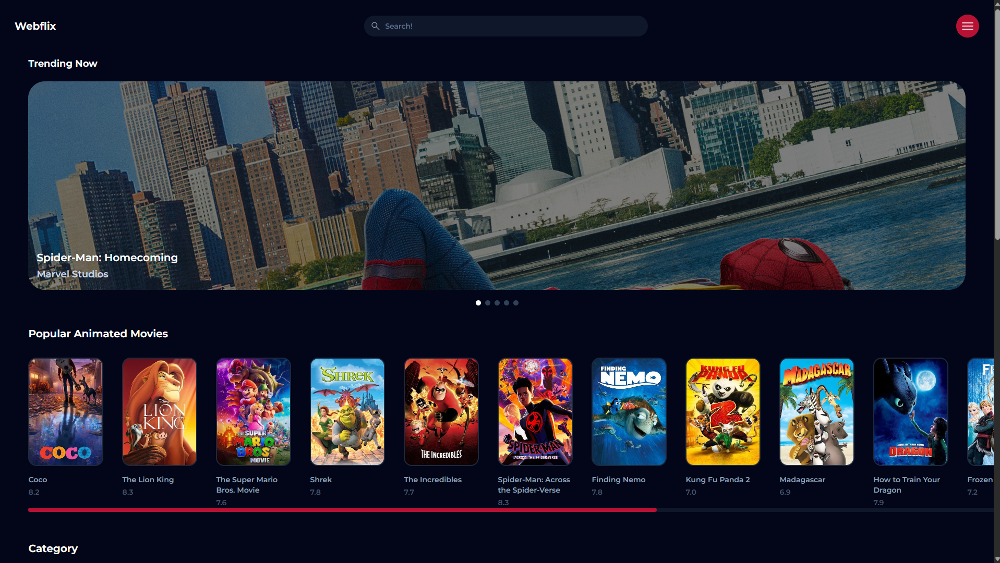

# Comet Weather:

Webflix is a modern movie API-based website that prioritizes UI/UX design, speed, efficency and responsiveness. Initially starting from scratch on Figma, then being developed with React and Tailwind CSS... the project very quickly grew in scope as the idea became realized. Webflix is able to fetch data for movies, shows and actors all with ease via the built in dynamic search bar with suggestions to based on your query.

There are pages for API-info that include: movie / show name, runtime, release date, rating, description, watch trailer button, genres section, cast members and similar movies. The page for actors includes: name, role, biography 3 pictures age, place and date of birth, as well as filmography for shows and movies they starred in. 

And on top of ALL this... Webflix was built mobile first, and all movies, sugguestions, cast members and so SO much more that doesn't render properly, ALL have back-up and fall-back elements ready to go! And yes, this also applies to error handling. Webflix above everything, embodies attention to detail! 

## Project Structure:
- `index.html`: Contains `main.jsx` and `style.css`.
- `style.css`: Very brief, but includes universal styles to common elements throught the project and imports Tailwind CSS.
- `main.jsx`: The main file of the entire project containing `App.jsx`, `style.css` and react-router-dom management.
- `App.jsx`: Includes `HomePage.jsx`, `Results.jsx`, `Movie.jsx`, `Actor.jsx`, `About.jsx` all for browser route management to access API-data and search with ease.
- `HomePage.jsx`: The final (BIG) jsx file containing the components for the `Header.jsx`, `Hero.jsx`, `Category.jsx`, `Footer.jsx`, `Animated.jsx`, `Categories.jsx`. This is a MASSASIVE component that makes up the landing page for Webflix, and it handles everything the user sees as soon as they enter the website, as well as containing all of the movie categories for the homepage within their respective rows.
- `Header.jsx`: The component responsible for ease of navigation. Containing the search bar, as well as links back to the homepage, the about section, and my portfolio!
- `Hero.jsx`: Contains a "Trending Now" section with a slider for popular movies and shows.
- `Animated.jsx`: Seperate from the `Categories.jsx` component, its a main part of the `Homepage.jsx` that includes popular animated movies.
- `Category.jsx`: Allows movies and shows in the `Homepage.jsx` to be sorted by adventure, anime, comedy and so on.
- `Categories.jsx`: Is NOT the same as `Category.jsx`! (Which allows sorting) This component is instead responsible for styling every category row the same way and keeping every `Movie.jsx` component in place.
- `Footer.jsx`: Links to my GitHub, Email and LinkedIn.
- `About.jsx`: Small brief page regarding: Project tech-stack, how the project works, about the creator.
- `SearchBar.jsx`: Contains 2 search bars (for both mobile and desktop) and is a key component of `Header.jsx`. Allowing you to dynamically search for actors, movies, shows and works hand in hand with `Results.jsx`.
- `Results.jsx`: Contains relevant search result data from `SearchBar.jsx`.
- `Movie.jsx`: Formats and styles a movie / show with the respective name, background, release date, runtime, reviews, watch trailer button, genres, `Actor.jsx` for cast members, and "More Like This" section.
- `Actor.jsx`: Going further deeper into `Movie.jsx`, here you can view data for an actor including name, age, date and place of birth, biography and filmography ranked by popularity!
